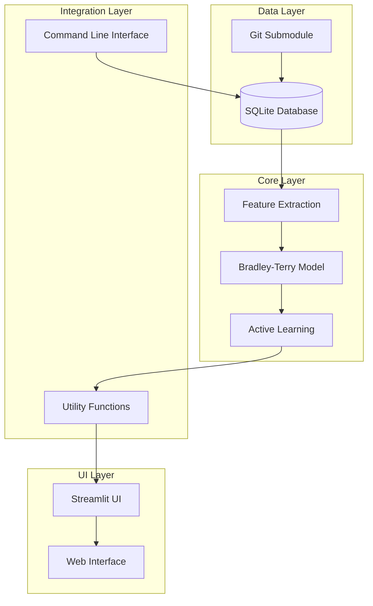

# System Architecture

**Goal**: Understand how the Name Ranking application processes 44,000+ names
using **Bayesian active learning** to learn your preferences in under 10
comparisons.

**Requirements**: Python 3.13+

> **Note**: For usage instructions, see the [Tutorial](tutorial.md). This
> document focuses on design decisions and system architecture for developers.

## Try It Now

Explore the architecture in 3 steps:

```bash
# 1. Initialize the database (creates SQLite schema and loads 44k names)
$ python -m name_ranking.cli init

# 2. Check the model status (view Bayesian model parameters)
$ python -m name_ranking.cli model-status

# 3. View database statistics (see table counts and size)
$ python -m name_ranking.cli stats
```

Expected output from `model-status`:
```
Model Status
============
Feature dimensions: 25
Training samples: 0
Mean weights: [0.0, 0.0, ...]
Covariance: 25x25 diagonal matrix
```

## Architecture Overview



## **Component Architecture**

### **Data Layer**

#### **SQLite Database** (`names.db`)

The database stores 4 tables:

- **Names table**: Stores 44,000+ names with gender and origin metadata
- **Ratings table**: Stores preference scores the system derives from the Bayesian model
- **Comparisons table**: Stores historical comparison data with 4 preference types:

- **Names table**: Core name metadata (name, gender, origin region)
- **Ratings table**: Preference scores derived from Bayesian model
- **Comparisons table**: Historical comparison data with four preference types:
  - `-1`: Prefer name_a over name_b
  - `1`: Prefer name_b over name_a
  - `0`: Draw (both equally preferred)
  - `2`: Down (dislike both names)

  > **Note**: Down votes (`2`) are recorded but excluded from preference statistics (win/loss/draw counts) displayed in the UI.

- **Model state**: Active learning model parameters
- **Automatic schema migration**: The system automatically upgrades existing databases to support the "down" preference (`2`)
- **Region mapping**: Geographic region classifications

#### **Git Submodule** Integration

- **Automatic updates**: The system tracks commit hashes to avoid redundant processing
- **Incremental sync**: The system processes only new or modified names
- **Data provenance**: The system maintains lineage from source data

### **Feature Extraction Layer** (`features.py`)

#### `FeatureExtractor` Class

- **Phonetic feature extraction**: The **FeatureExtractor** applies Double Metaphone encoding
- **Linguistic analysis**: The system counts syllables and calculates vowel ratios
- **Metadata encoding**: The system one-hot encodes gender and origin region
- **Caching mechanism**: The **FeatureExtractor** maintains an in-memory cache for performance
- **Batch processing**: The system efficiently extracts features for all 44,000 names

#### Feature Pipeline

1. **Text normalization**: The pipeline converts text to lowercase and applies Unicode normalization
2. **Phonetic encoding**: The pipeline generates Double Metaphone primary/secondary codes
3. **Linguistic analysis**: The pipeline computes character statistics and syllable counts
4. **Metadata lookup**: The pipeline queries the database for gender and origin
5. **Normalization**: The pipeline applies min-max scaling to [0,1] range
6. **Vector assembly**: The pipeline concatenates features into a 25-dimensional vector

### **Machine Learning Layer** (`model.py`)

#### `BradleyTerryModel` Class

- **Bayesian inference**: The model uses a Gaussian prior with Laplace approximation
- **Weight management**: The model maintains a 25-dimensional mean vector and 25×25 covariance matrix
- **Thompson sampling**: The algorithm balances exploration and exploitation during candidate selection
- **Database persistence**: The model saves and loads state to SQLite

#### `ModelState` Dataclass

- **Mean weights**: The system's current estimate of feature importances (25 values)
- **Covariance matrix**: Uncertainty in weight estimates (25×25 matrix)
- **Feature metadata**: Names and dimensions of all 25 features
- **Training statistics**: Sample count and timestamps

#### Model Operations

The model performs 5 core operations:

- **Initialization**: Creates zero-mean prior with diagonal covariance
- **Update**: Performs Bayesian update from each pairwise comparison
- **Prediction**: Computes preference probabilities between any 2 names
- **Sampling**: Performs Thompson sampling for active learning
- **Persistence**: Serializes and deserializes state to database

### **Active Learning Layer** (`utils.py`)

#### Candidate Selection

- **Thompson sampling**: The algorithm maximizes information gain
- **Diversity constraint**: The system ensures feature space coverage
- **History avoidance**: The system prevents repetitive comparisons
- **Fallback mechanism**: The system selects randomly if the model becomes unavailable

#### Rating Synchronization

- **Utility computation**: The system converts model weights to preference scores
- **Batch updates**: The system processes all 44,000 names efficiently
- **Consistency checks**: The system validates all rating calculations

#### Integration Functions

- `get_active_learning_model()`: Singleton model instance
- `get_feature_extractor()`: Singleton feature extractor
- `update_model_and_save()`: Process comparison and update model
- `_update_ratings_from_model()`: Sync ratings from model weights

### **Integration Layer**

#### Model Integration

- **Preference update functions**: Three functions handle the four preference types:
  - `update_preference_and_save()`: For `-1` (prefer left) and `1` (prefer right)
  - `update_preference_draw_and_save()`: For `0` (draw)
  - `update_preference_down_and_save()`: For `2` (down/dislike both)
- **Rating synchronization**: The system converts model utilities to preference scores for display
- **Comparison logging**: The system stores all comparisons in the database with preference values
- **UI integration**: Streamlit interface calls model update functions directly

#### Error Handling

- **Graceful degradation**: The system falls back to random selection if the model fails
- **Data consistency**: The system ensures atomic updates through database transactions
- **Recovery mechanisms**: The system reinitializes the model if it becomes corrupted

### **User Interface Layer**

#### Streamlit Application (`main.py`)

- **Tournament interface**: The UI presents side-by-side name comparisons
- **Similarity search**: The UI supports multi-method name matching
- **Filter controls**: The UI provides gender and origin region filters
- **Administration**: The UI includes database sync and classification controls

#### UI Components (`ui.py`)

- **Name display**: The components render formatted name presentations
- **Comparison interface**: The components provide voting buttons and keyboard shortcuts
- **Statistics display**: The components show top rankings and progress indicators
- **Filter widgets**: The components render interactive filter controls

### **Command Line Interface** (`cli.py`)

#### Database Management

- `init`: Initialize database schema and sync names
- `process`: Run origin classification tasks
- `stats`: Display database statistics
- `model-status`: Show active learning model status
- `model-reset`: Reinitialize active learning model

#### Development Tools

- **Batch processing**: You control classification batch sizes
- **Progress tracking**: The CLI shows real-time progress indicators
- **Error reporting**: The system displays detailed error messages and diagnostics

## **Data Flow**

### **Comparison Workflow**

```python
from typing import Tuple

# 1. User initiates comparison
name_a, name_b = select_candidates()

# 2. User votes with four possible preferences
if user_prefers_a:
    update_preference_and_save(name_a, name_b)  # preference = -1
elif user_prefers_b:
    update_preference_and_save(name_b, name_a)  # preference = 1
elif user_draw:
    update_preference_draw_and_save(name_a, name_b)  # preference = 0
elif user_down:
    update_preference_down_and_save(name_a, name_b)  # preference = 2

# 3. Under the hood
def update_preference_and_save(winner: str, loser: str) -> dict:
    # Record comparison in database
    database.record_comparison(winner, loser, preference=-1)

    # Update Bayesian model (Bradley-Terry with Laplace approximation)
    model.update_based_on_preference(winner, loser, preference=-1)

    # Sync ratings from updated model weights
    _update_ratings_from_model()

    # Return updated ratings for UI display
    return database.get_ratings()
```

### **Feature Computation Flow**

```python
from typing import Dict, Any

# 1. First-time feature extraction
features: Dict[str, Any] = {}
for name in all_names:
    features[name] = extract_features(name)

# 2. Cached subsequent access
def get_name_features(name: str) -> Any:
    if name in cache:
        return cache[name]
    else:
        features = extract_features(name)
        cache[name] = features
        return features
```

### **Model Update Flow**

```python
from typing import Any

# preference values: -1 (prefer name_a), 1 (prefer name_b), 0 (draw), 2 (down)

# 1. Record comparison
record_preference_comparison(name_a: str, name_b: str, preference: int) -> None

# 2. Update model (handles all four preference types)
model.update(name_a_features: Any, name_b_features: Any, preference: int) -> None

# 3. Save state
model.save_to_db() -> None

# 4. Update ratings
ratings: dict = compute_ratings_from_model(model)
database.update_ratings(ratings)
```

## **Deployment Architecture**

### **Development Environment**

- **Local SQLite**: Single-file database for development
- **Streamlit local server**: Development web server
- **UV package management**: Fast Python dependency resolution
- **Nix environment**: Reproducible development environment

### **Production Considerations**

- **Database scaling**: SQLite supports single-user/moderate load scenarios
- **Model persistence**: The system stores model state in the database
- **Feature caching**: In-memory cache for performance
- **Error resilience**: Graceful degradation features

### **Monitoring and Logging**

- **Comparison logging**: The system stores all comparisons in the database
- **Model metrics**: The system tracks training samples and uncertainty measures
- **Performance metrics**: The system monitors response times and cache hit rates
- **Error tracking**: The system logs failed operations and recovery attempts

## **Security Considerations**

### Data Protection

- **Local storage**: The application stores all data locally in SQLite
- **No external APIs**: The system performs origin classification using a local library
- **Input validation**: The application validates and sanitizes all name inputs
- **SQL injection prevention**: The system uses parameterized queries

### User Privacy

- **No personal data**: The system stores only name rankings
- **Anonymous usage**: The application requires no user accounts or tracking
- **Local processing**: All computation happens locally
- **Data ownership**: You control your own database

## **Performance Characteristics**

### Memory Usage

- **Feature cache**: ~44k names × 25 features × 8 bytes ≈ 9MB
- **Model state**: 25 weights + 25×25 covariance ≈ 5KB
- **Name data**: ~44k names with metadata ≈ 5-10MB

### Computation Time

- **Feature extraction**: ~1ms per name (cached after first)
- **Model update**: ~1ms per comparison
- **Pair selection**: ~10-100ms for Thompson sampling
- **Rating sync**: ~100ms for all 44k names

### Database Operations

- **Comparison recording**: <1ms with indexes
- **Rating updates**: Bulk updates process all 44k names in ~100ms
- **Model persistence**: <10ms for serialization/deserialization

## **Extension Points**

### New Feature Types

1. Add feature extraction function to `FeatureExtractor`
2. Update the feature normalization pipeline
3. Retrain the model with the new feature dimension

### Alternative Models

1. Implement a new model class with the same interface
2. Update the `get_active_learning_model()` factory function
3. Ensure backward compatibility

### UI Enhancements

1. Add new **Streamlit** components to `ui.py`
2. Extend filter options in the sidebar
3. Add new visualization components

### Data Sources

1. Implement a new data loader class
2. Add synchronization logic for the new source
3. Update the database schema as needed

## **Design Principles**

### Separation of Concerns

- **Data layer**: Pure database operations
- **ML layer**: Pure machine learning algorithms
- **UI layer**: Pure presentation logic
- **Integration layer**: Glue code with clear interfaces

### Backward Compatibility

- **API stability**: The system maintains existing function signatures
- **Data migration**: The application automatically upgrades schemas
- **UI consistency**: The application introduces no breaking changes for users

### Progressive Enhancement

- **Basic functionality**: The preference system always works
- **Enhanced features**: The system enables active learning when available
- **Graceful degradation**: The system provides fallback mechanisms for failures

### Testability

- **Unit tests**: Isolated component testing
- **Integration tests**: Cross-component workflows
- **Mocking**: External dependencies mocked for tests

## See Also

- [Tutorial](tutorial.md) - Step-by-step usage guide
- [Active Learning System](active_learning.md) - Theoretical foundations
- [Home](index.md) - Overview and quick start
