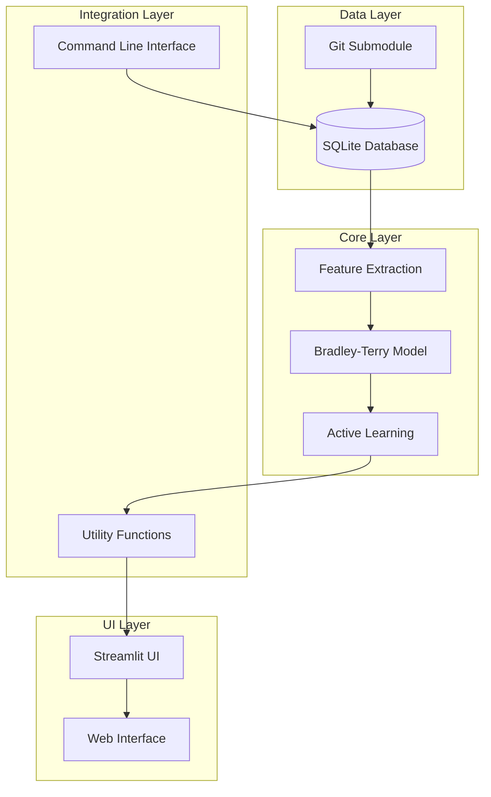

# System Architecture

The Name Ranking application follows a modular architecture with clear
separation between data management, machine learning, and user interface
components.

> **Note**: For usage instructions, see the [Tutorial](tutorial.md). This
> document focuses on design decisions and system architecture for developers.

## Architecture Overview



## Component Architecture

### Data Layer

#### SQLite Database (`names.db`)

- **Names table**: Core name metadata (name, gender, origin region)
- **Ratings table**: Preference scores derived from Bayesian model
- **Comparisons table**: Historical comparison data with four preference types:
  - `-1`: Prefer name_a over name_b
  - `1`: Prefer name_b over name_a
  - `0`: Draw (both equally preferred)
  - `2`: Down (dislike both names)

  > **Note**: Down votes (`2`) are recorded but excluded from preference statistics (win/loss/draw counts) displayed in the UI.

- **Model state**: Active learning model parameters
- **Automatic schema migration**: Existing databases automatically upgrade to support the "down" preference (`2`)
- **Region mapping**: Geographic region classifications

#### Git Submodule Integration

- **Automatic updates**: Track commit hashes to avoid redundant processing
- **Incremental sync**: Only process new or modified names
- **Data provenance**: Maintain lineage from source data

### Feature Extraction Layer (`features.py`)

#### `FeatureExtractor` Class

- **Phonetic feature extraction**: Double Metaphone encoding
- **Linguistic analysis**: Syllable counting, vowel ratios
- **Metadata encoding**: Gender, origin region one-hot encoding
- **Caching mechanism**: In-memory cache for performance
- **Batch processing**: Efficient feature extraction for all names

#### Feature Pipeline

1. **Text normalization**: Lowercase, Unicode normalization
2. **Phonetic encoding**: Double Metaphone primary/secondary codes
3. **Linguistic analysis**: Character statistics, syllable counting
4. **Metadata lookup**: Database queries for gender/origin
5. **Normalization**: Min-max scaling to [0,1] range
6. **Vector assembly**: Concatenation into 25-dimensional feature vector

### Machine Learning Layer (`model.py`)

#### `BradleyTerryModel` Class

- **Bayesian inference**: Gaussian prior with Laplace approximation
- **Weight management**: Mean vector and covariance matrix
- **Thompson sampling**: Exploration-exploitation balance
- **Database persistence**: Save/load model state to SQLite

#### `ModelState` Dataclass

- **Mean weights**: Current estimate of feature importances
- **Covariance matrix**: Uncertainty in weight estimates
- **Feature metadata**: Names and dimensions of features
- **Training statistics**: Sample count, timestamps

#### Model Operations

- **Initialization**: Zero-mean prior with diagonal covariance
- **Update**: Bayesian update from pairwise comparison
- **Prediction**: Compute preference probabilities
- **Sampling**: Thompson sampling for active learning
- **Persistence**: Serialize/deserialize to database

### Active Learning Layer (`utils.py`)

#### Candidate Selection

- **Thompson sampling**: Maximize information gain
- **Diversity constraint**: Ensure feature space coverage
- **History avoidance**: Prevent repetitive comparisons
- **Fallback mechanism**: Random selection if model unavailable

#### Rating Synchronization

- **Utility computation**: Convert model weights to preference scores
- **Batch updates**: Efficient processing of all names
- **Consistency checks**: Validate rating calculations

#### Integration Functions

- `get_active_learning_model()`: Singleton model instance
- `get_feature_extractor()`: Singleton feature extractor
- `update_model_and_save()`: Process comparison and update model
- `_update_ratings_from_model()`: Sync ratings from model weights

### Integration Layer

#### Model Integration

- **Preference update functions**: Three functions handle the four preference types:
  - `update_preference_and_save()`: For `-1` (prefer left) and `1` (prefer right)
  - `update_preference_draw_and_save()`: For `0` (draw)
  - `update_preference_down_and_save()`: For `2` (down/dislike both)
- **Rating synchronization**: Model utilities converted to preference scores for
  display
- **Comparison logging**: All comparisons stored in database with preference values
- **UI integration**: Streamlit interface calls model update functions directly

#### Error Handling

- **Graceful degradation**: Fallback to random selection if model fails
- **Data consistency**: Transactions ensure atomic updates
- **Recovery mechanisms**: Model reinitialization if corrupted

### User Interface Layer

#### Streamlit Application (`main.py`)

- **Tournament interface**: Side-by-side name comparison
- **Similarity search**: Multi-method name matching
- **Filter controls**: Gender and origin region filters
- **Administration**: Database sync and classification controls

#### UI Components (`ui.py`)

- **Name display**: Formatted name presentation
- **Comparison interface**: Voting buttons and keyboard shortcuts
- **Statistics display**: Top rankings and progress indicators
- **Filter widgets**: Interactive filter controls

### Command Line Interface (`cli.py`)

#### Database Management

- `init`: Initialize database schema and sync names
- `process`: Run origin classification tasks
- `stats`: Display database statistics
- `model-status`: Show active learning model status
- `model-reset`: Reinitialize active learning model

#### Development Tools

- **Batch processing**: Control classification batch sizes
- **Progress tracking**: Real-time progress indicators
- **Error reporting**: Detailed error messages and diagnostics

## Data Flow

### Comparison Workflow

```python
# 1. User initiates comparison
name_a, name_b = select_candidates()

# 2. User votes with four possible preferences
if user_prefers_a:
    update_preference_and_save(name_a, name_b)  # preference = -1
elif user_prefers_b:
    update_preference_and_save(name_b, name_a)  # preference = 1
elif user_draw:
    update_preference_draw_and_save(name_a, name_b)  # preference = 0
elif user_down:
    update_preference_down_and_save(name_a, name_b)  # preference = 2

# 3. Under the hood
def update_preference_and_save(winner, loser):
    # Record comparison in database
    database.record_comparison(winner, loser, preference=-1)

    # Update Bayesian model (Bradley-Terry with Laplace approximation)
    model.update_based_on_preference(winner, loser, preference=-1)

    # Sync ratings from updated model weights
    _update_ratings_from_model()

    # Return updated ratings for UI display
    return database.get_ratings()
```

### Feature Computation Flow

```python
# 1. First-time feature extraction
features = {}
for name in all_names:
    features[name] = extract_features(name)

# 2. Cached subsequent access
def get_name_features(name):
    if name in cache:
        return cache[name]
    else:
        features = extract_features(name)
        cache[name] = features
        return features
```

### Model Update Flow

```python
# preference values: -1 (prefer name_a), 1 (prefer name_b), 0 (draw), 2 (down)

# 1. Record comparison
record_preference_comparison(name_a, name_b, preference)

# 2. Update model (handles all four preference types)
model.update(name_a_features, name_b_features, preference)

# 3. Save state
model.save_to_db()

# 4. Update ratings
ratings = compute_ratings_from_model(model)
database.update_ratings(ratings)
```

## Deployment Architecture

### Development Environment

- **Local SQLite**: Single-file database for development
- **Streamlit local server**: Development web server
- **UV package management**: Fast Python dependency resolution
- **Nix environment**: Reproducible development environment

### Production Considerations

- **Database scaling**: SQLite suitable for single-user/moderate load
- **Model persistence**: Database-backed model state
- **Feature caching**: In-memory cache for performance
- **Error resilience**: Graceful degradation features

### Monitoring and Logging

- **Comparison logging**: Complete history of all comparisons
- **Model metrics**: Training samples, uncertainty measures
- **Performance metrics**: Response times, cache hit rates
- **Error tracking**: Failed operations and recovery attempts

## Security Considerations

### Data Protection

- **Local storage**: All data stored locally in SQLite
- **No external APIs**: Origin classification uses local library
- **Input validation**: Name validation and sanitization
- **SQL injection prevention**: Parameterized queries

### User Privacy

- **No personal data**: Only name rankings stored
- **Anonymous usage**: No user accounts or tracking
- **Local processing**: All computation happens locally
- **Data ownership**: Users control their own database

## Performance Characteristics

### Memory Usage

- **Feature cache**: ~44k names × 25 features × 8 bytes ≈ 9MB
- **Model state**: 25 weights + 25×25 covariance ≈ 5KB
- **Name data**: ~44k names with metadata ≈ 5-10MB

### Computation Time

- **Feature extraction**: ~1ms per name (cached after first)
- **Model update**: ~1ms per comparison
- **Pair selection**: ~10-100ms for Thompson sampling
- **Rating sync**: ~100ms for all 44k names

### Database Operations

- **Comparison recording**: <1ms with indexes
- **Rating updates**: Bulk updates optimize performance
- **Model persistence**: <10ms for serialization/deserialization

## Extension Points

### New Feature Types

1. Add feature extraction function to `FeatureExtractor`
2. Update feature normalization
3. Retrain model with new feature dimension

### Alternative Models

1. Implement new model class with same interface
2. Update `get_active_learning_model()` factory
3. Maintain backward compatibility

### UI Enhancements

1. Add new Streamlit components to `ui.py`
2. Extend filter options in sidebar
3. Add visualization components

### Data Sources

1. Implement new data loader class
2. Add synchronization logic
3. Update database schema as needed

## Design Principles

### Separation of Concerns

- **Data layer**: Pure database operations
- **ML layer**: Pure machine learning algorithms
- **UI layer**: Pure presentation logic
- **Integration layer**: Glue code with clear interfaces

### Backward Compatibility

- **API stability**: Maintain existing function signatures
- **Data migration**: Automatic schema upgrades
- **UI consistency**: No breaking changes for users

### Progressive Enhancement

- **Basic functionality**: Preference system always works
- **Enhanced features**: Active learning when available
- **Graceful degradation**: Fallback mechanisms for failures

### Testability

- **Unit tests**: Isolated component testing
- **Integration tests**: Cross-component workflows
- **Mocking**: External dependencies mocked for tests

## See Also

- [Tutorial](tutorial.md) - Step-by-step usage guide
- [Active Learning System](active_learning.md) - Theoretical foundations
- [Home](index.md) - Overview and quick start
